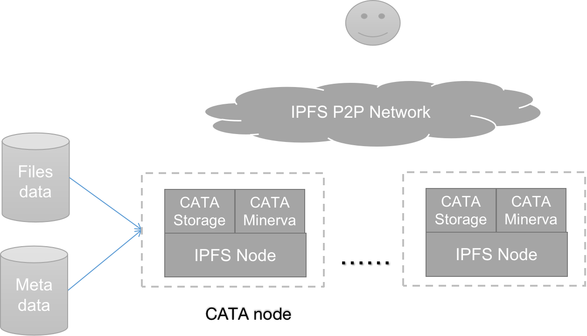

# CATA Node Introduction

Cata node is built based on IPFS node.

It could run the files storage and metadata storage functions.

CATA.Storage could be regarded as the Consensus layer of IPFS, provide file storage.

CATA.minerva provides the metadata storage and search functions, It's could be regarded as the 'big query' system of Google.
